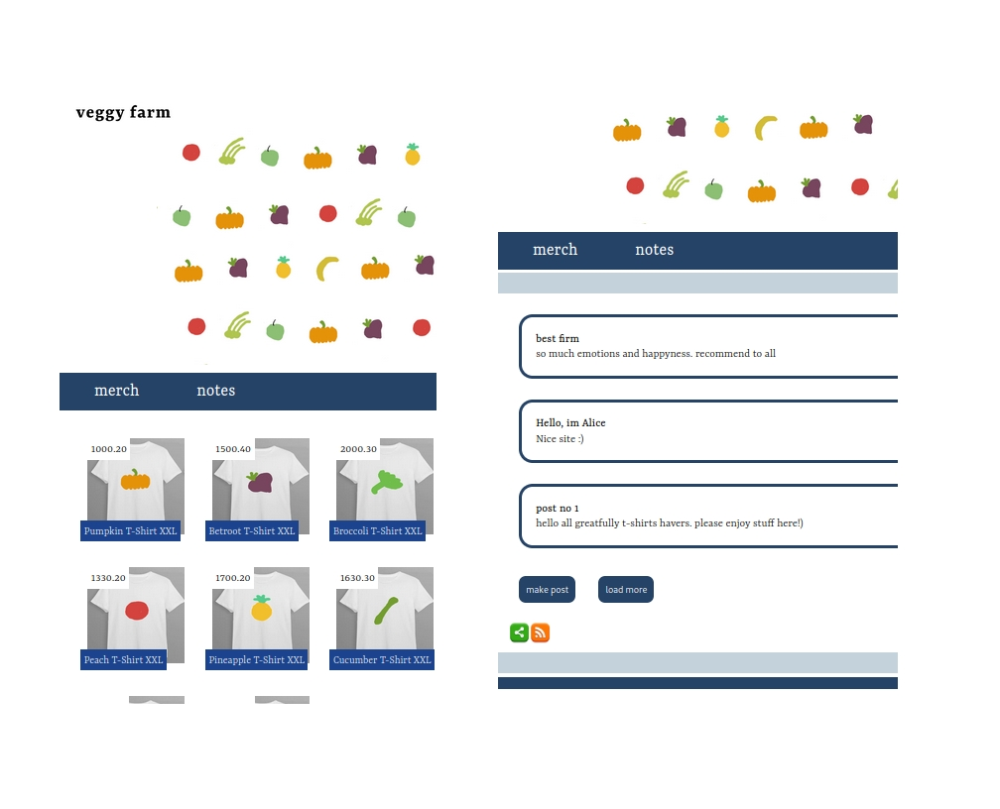

# veggy-farm  
  
Мой быстрый старт с Джанго. Фирменный мерч с заметками.
  
Фронтенд собирается на Gulp и Webpack  
Бэкенд - Джанго, SQLite3  
Пользователь админ (поменять пароль при установке) - joe  
Проект может работать с докер: `docker compose up` and visit http://127.0.0.1:8000/  

 

